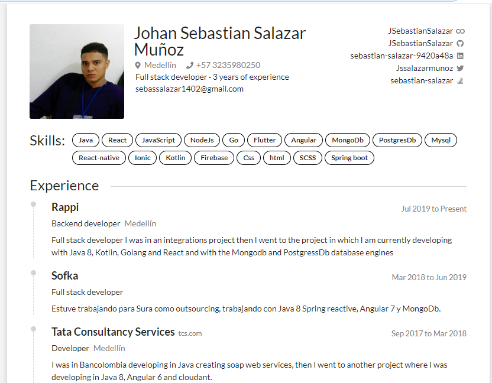

## Instructions
```
git clone git@github.com:JSebastianSalazar/portafolio/edit/master/README.md
cd portafolio
yarn install or npm install
yarn start or npm start
```
Ex. **[My Resume →](https://gitconnected.com/jsebastiansalazar/resume)** (https://gitconnected.com/jsebastiansalazar/resume)


## Packages
- React (using create-react-app)
- Styled Components
- Carbon Design
- Material Ui
